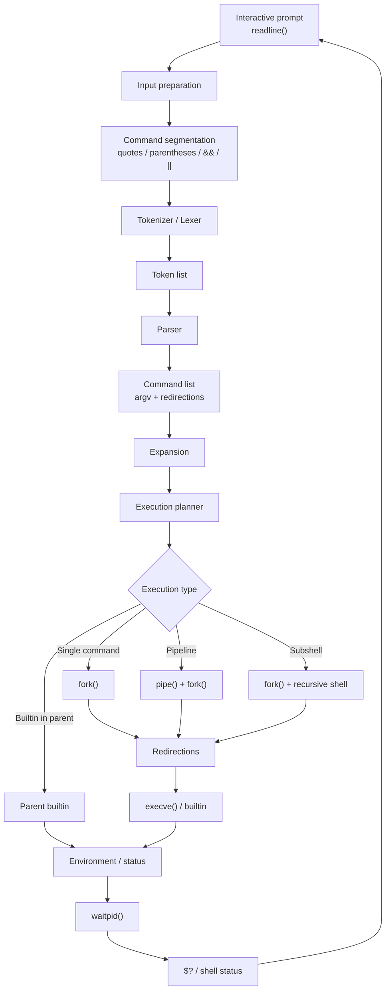

*This project has been created as part of the 42 curriculum by sofernan.*

# Minishell

<p align="center">
  <strong>A POSIX-inspired command-line shell implemented from scratch in C</strong><br>
  Process management · Parsing · Pipelines · Redirections · Signals · Environment · Expansion
</p>

<p align="center">
  
  
  
  
</p>

---

## Overview

**Minishell** is a Unix shell implemented in C as part of the 42 curriculum.

The project focuses on reproducing the core behaviour of a shell while implementing the underlying mechanisms manually: command-line parsing, tokenization, quoting, environment expansion, redirections, pipelines, process creation, signal handling, built-ins and exit-status propagation.

The implementation is deliberately structured around low-level Unix primitives such as:

`fork()` · `execve()` · `waitpid()` · `pipe()` · `dup()` · `dup2()` · `open()` · `close()` · `stat()` · `opendir()` · `readdir()`

The result is a small shell engine that transforms raw user input into executable command structures and finally into a process graph connected through Unix file descriptors.

---

## Architecture



### Execution pipeline

The main input path can be summarized as:

```text
                    USER INPUT
                        │
                        ▼
              ┌──────────────────┐
              │ Input preparation │
              │ continuation      │
              │ operator splitting│
              └────────┬─────────┘
                       │
                       ▼
              ┌──────────────────┐
              │ Tokenization     │
              │ words / quotes   │
              │ metacharacters   │
              └────────┬─────────┘
                       │
                       ▼
              ┌──────────────────┐
              │ Parsing          │
              │ commands + redir │
              └────────┬─────────┘
                       │
                       ▼
              ┌──────────────────┐
              │ Expansion        │
              │ $VAR / $? / glob │
              └────────┬─────────┘
                       │
                       ▼
              ┌──────────────────┐
              │ Process manager  │
              │ fork / pipe / fd │
              └────────┬─────────┘
                       │
                       ▼
              ┌──────────────────┐
              │ Execution        │
              │ builtin / execve │
              └────────┬─────────┘
                       │
                       ▼
                  EXIT STATUS
                       │
                       └──────► $?
```

---

## Core Features

### Command parsing

The parser is split into multiple stages instead of attempting to execute the raw input directly.

It handles:

- Whitespace-aware tokenization
- Single and double quotes
- Metacharacters
- Adjacent quoted/unquoted token parts
- Syntax validation
- Pipe validation
- Incomplete command continuation
- Parenthesized command segments
- `&&` and `||` command segmentation

The tokenizer keeps metadata about each token, including:

- token type
- quote context
- adjacency
- expansion type

This allows later stages to distinguish syntax from expansion and execution concerns.

---

### Quoting

Minishell implements separate handling for:

```bash
'literal $HOME'
"expanded $HOME"
unquoted $HOME
```

Single quotes preserve their contents literally, while double quotes allow variable expansion and handle the supported escape cases.

The tokenizer also tracks whether a word is composed of mixed quoted and unquoted sections.

---

### Environment management

The shell maintains its environment as a linked list:

```text
t_env
 ├── name
 ├── value
 ├── exported
 └── next
```

This makes shell-side operations such as:

```bash
export NAME=value
unset NAME
cd ...
```

independent from the `char **envp` representation required by `execve()`.

When a process is executed, the linked-list environment is converted into an array:

```text
t_env linked list
       │
       ▼
make_env_array()
       │
       ▼
char **env
       │
       ▼
execve()
```

The implementation also maintains shell status through the internal `?` environment entry, allowing `$?` to reflect the most recent command status.

---

## Process & File Descriptor Management

One of the main technical objectives of Minishell is understanding how Unix processes communicate.

### Pipelines

For:

```bash
ls -la | grep minishell | wc -l
```

the shell creates a process chain connected by pipes:

```text
┌────────────┐     pipe      ┌────────────┐     pipe      ┌────────────┐
│    ls      │ ────────────► │    grep    │ ────────────►│    wc      │
│            │               │            │               │            │
│ stdout ────┼──────────────►│ stdin      │               │            │
└────────────┘               │ stdout ────┼──────────────►│ stdin      │
                             └────────────┘               └────────────┘
```

The pipeline executor manages:

- `pipe()` creation
- `fork()` for each command
- previous pipe read-end propagation
- `dup2()` for stdin/stdout wiring
- closing unused descriptors
- parent-side descriptor cleanup
- `waitpid()` for process synchronization
- exit status retrieval from the last command

This is implemented through the execution path centered around:

```text
process_and_exec.c
execute_pipeline.c
execute_command.c
utils_execute.c
```

---

### Redirections

Supported redirections:

| Syntax | Behaviour |
|---|---|
| `< file` | Redirect standard input |
| `> file` | Redirect standard output, truncate |
| `>> file` | Redirect standard output, append |
| `<< LIMITER` | Read input until the delimiter |

Redirections are represented explicitly:

```text
t_command
   │
   └── redirs
        │
        ├── T_RED_IN
        ├── T_RED_OUT
        ├── T_RED_APPEND
        └── T_HEREDOC
```

At execution time each redirection is converted into the appropriate file descriptor operation and connected with `dup2()`.

---

## Here-Documents

Here-documents are implemented as a dedicated execution path.

Example:

```bash
cat << EOF
hello
$USER
EOF
```

The implementation:

1. Saves the current standard input.
2. Creates a temporary heredoc file.
3. Reads lines until the delimiter is encountered.
4. Expands environment variables when the delimiter is unquoted.
5. Restores standard input.
6. Attaches the generated file as the command's input redirection.
7. Removes temporary files during cleanup.

Signal handling is also adapted while reading heredoc input so that `Ctrl-C` can abort the operation and restore the shell state.

Relevant implementation:

```text
here_doc.c
parse_heredoc.c
utils_heredoc.c
```

---

## Built-ins

Minishell distinguishes between built-ins that must affect the parent shell state and built-ins that can execute in a child process.

### Parent-side built-ins

These need to modify the shell process itself:

```text
cd
export
unset
exit
```

For example:

```bash
cd /tmp
pwd
```

`cd` must change the working directory of the shell rather than a temporary child process.

### Child-side built-ins

These can execute within the command process:

```text
echo
pwd
env
```

The implementation separates the two execution paths:

```text
exec_builtin_parent.c
exec_builtin_child.c
```

This distinction becomes particularly important when built-ins are part of a pipeline.

---

## Command Execution

The command execution layer resolves executables through three main paths.

### 1. Built-in

```text
command
   │
   └── builtin?
       ├── parent execution
       └── child execution
```

### 2. Explicit path

Commands containing `/` are handled as explicit paths:

```bash
./program
/usr/bin/env
/bin/ls
```

The implementation validates existence, directory status and execute permissions before calling `execve()`.

### 3. PATH lookup

For a normal command:

```bash
ls
```

the shell retrieves `PATH`, splits it into directories and tries candidate executable paths until a valid executable is found.

```text
PATH
 │
 ├── /usr/local/bin
 ├── /usr/bin
 ├── /bin
 └── ...
       │
       ▼
  candidate path
       │
       ▼
    execve()
```

---

## Expansion

The expansion layer supports:

### Environment variables

```bash
echo $HOME
echo $USER
echo $PATH
```

### Exit status

```bash
echo $?
```

The status is updated after command execution and exposed through the shell's internal status representation.

### Wildcard expansion

The bonus implementation includes filename matching for:

```text
*
?
[abc]
[a-z]
[!abc]
```

The globbing engine:

1. Detects wildcard patterns.
2. Splits the input into directory and pattern components.
3. Opens the relevant directory with `opendir()`.
4. Iterates through entries using `readdir()`.
5. Matches names against the pattern.
6. Sorts matched paths.
7. Adds the resulting paths to the command arguments.

Hidden files are excluded unless the pattern explicitly begins with `.`.

---

## Signals & Interactive Behaviour

Signal handling is separated between the interactive shell and child processes.

```text
                 Interactive shell
                        │
             ┌──────────┴──────────┐
             │                     │
          SIGINT                SIGQUIT
             │                     │
       refresh prompt             ignore
             │
             ▼
          g_status

                 Child process
                        │
              ┌─────────┴─────────┐
              │                   │
           SIGINT              SIGQUIT
              │                   │
           default             default
```

The shell uses a single global signal status variable:

```c
volatile sig_atomic_t g_status;
```

The global variable stores signal-related status information rather than the shell's main data structures.

Interactive behaviour includes:

| Input | Behaviour |
|---|---|
| `Ctrl-C` | Interrupt current input / command |
| `Ctrl-D` | Exit interactive shell |
| `Ctrl-\` | Ignored by the interactive shell |

Child processes restore default signal behaviour where appropriate.

---

## Bonus: Boolean Operators & Subshells

The implementation extends the mandatory shell with:

```bash
command1 && command2
command1 || command2
(command1)
```

Boolean operators are processed while respecting:

- quoting
- parenthesis depth
- operator boundaries
- command exit status

Example:

```bash
mkdir build && cd build
```

If the first command returns a non-zero status, the second command is skipped.

Likewise:

```bash
command || echo "fallback"
```

executes the fallback only when the previous command fails.

### Subshell execution

Parenthesized expressions are executed in a child process with a separate `t_minishell` state:

```text
Parent shell
     │
     │ fork()
     ▼
Child shell
     │
     ├── create environment
     ├── process inner command
     ├── execute recursively
     └── exit(status)
             │
             ▼
        waitpid()
             │
             ▼
       Parent $?
```

This provides process isolation for commands executed inside parentheses.

---

## Internal Data Model

The implementation uses explicit structures for each major shell stage.

```text
t_minishell
│
├── t_env *env_list
│
├── t_token *t_list
│
├── t_command *cmd_list
│     │
│     └── t_redir *redirs
│
├── t_pipex *pipex_data
│     ├── pid[]
│     ├── prev_fd
│     └── n_cmds
│
└── tokenizer / execution state
```

### Token representation

```text
t_token
├── value
├── type
├── quote
├── expansion_type
├── adjacent
└── next
```

### Command representation

```text
t_command
├── argv
├── infile
├── outfile
├── heredoc_file
├── redirs
├── append
├── is_heredoc
└── next
```

The explicit separation between tokens, commands and redirections keeps parsing concerns independent from process execution.

---

## Project Structure

```text
minishell/
│
├── Parsing
│   ├── tokenize_input.c
│   ├── extract_next_token.c
│   ├── extract_quoted_token.c
│   ├── extract_metachar.c
│   ├── get_next_token_part.c
│   ├── parse_commands.c
│   ├── parse_redir1.c
│   ├── parse_redir2.c
│   └── prepare_segments.c
│
├── Expansion
│   ├── expand_dollar.c
│   ├── expand_matches.c
│   ├── match_glob.c
│   ├── init_glob.c
│   └── process_dir.c
│
├── Execution
│   ├── execute_command.c
│   ├── execute_pipeline.c
│   ├── process_and_exec.c
│   ├── process_command.c
│   ├── process_segment.c
│   ├── utils_execute.c
│   └── execute_subshell.c
│
├── Built-ins
│   ├── ft_cd.c
│   ├── ft_cmd.c
│   ├── ft_export.c
│   ├── exec_builtin_parent.c
│   └── exec_builtin_child.c
│
├── Heredoc
│   ├── here_doc.c
│   ├── parse_heredoc.c
│   └── utils_heredoc.c
│
├── Environment
│   ├── add_env_node.c
│   ├── append_var.c
│   ├── set_env_var.c
│   ├── make_env_array.c
│   └── env_to_array.c
│
├── Memory / Error handling
│   ├── free_minishell.c
│   └── free_and_exit.c
│
├── libft/
│
├── main.c
├── mini.h
├── Makefile
│
├── minishell_tester1/
├── minishell_tester2/
└── new_suppression.supp
```

---

## Build

### Requirements

- Unix-like operating system
- `cc`
- GNU Readline
- `make`
- `valgrind` for memory analysis (optional)

### Compile

```bash
make
```

The Makefile builds `libft` first and then compiles the Minishell sources with:

```text
-Wall -Wextra -Werror
```

### Clean

```bash
make clean
```

### Full clean

```bash
make fclean
```

### Rebuild

```bash
make re
```

### Valgrind

The repository includes a Valgrind suppression file and a dedicated target:

```bash
make valgrind
```

---

## Usage

Start the shell with:

```bash
./minishell
```

Example session:

```console
$ ./minishell
/home/user Minishell> echo "Hello, world!"
Hello, world!

/home/user Minishell> echo $USER
user

/home/user Minishell> cat Makefile | grep CC
CC = cc

/home/user Minishell> echo "exit status: $?"
exit status: 0
```

### Redirections

```bash
echo "hello" > output.txt
cat < output.txt
echo "world" >> output.txt
cat << EOF
heredoc content
EOF
```

### Pipelines

```bash
ls -la | grep ".c" | wc -l
```

### Boolean operators

```bash
make && echo "build succeeded"
```

### Subshells

```bash
(cd /tmp && pwd)
```

### Wildcards

```bash
ls *.c
ls src/[a-z]*.c
```

---

## Testing

The repository contains two testing environments:

### Minishell Tester 1

Organized into focused test groups:

```text
builtins
pipes
redirects
syntax
heredoc
signals
wildcards
extras
```

Example:

```bash
cd minishell_tester1
./tester builtins
./tester pipes
./tester redirects
```

### Minishell Tester 2

The second tester is Python-based and covers:

```text
Parsing
Commands
Redirects
Pipe
Exit status
Booleans
Wildcards
```

Typical execution:

```bash
python3 src/__main__.py [project-path]
```

> Test suites are useful regression tools, but they are not exhaustive. Manual testing remains important for shell behaviour, edge cases and operating-system-specific behaviour.

---

## Error Handling & Memory

The implementation contains dedicated cleanup paths for the shell's main dynamic structures:

```text
Environment list
Token list
Command list
Redirection list
Pipe execution state
String arrays
Tokenizer state
```

The project also provides centralized cleanup helpers for error and exit paths.

The Makefile includes Valgrind configuration with:

```text
--leak-check=full
--show-leak-kinds=all
--track-origins=yes
--track-fds=yes
--trace-children=yes
```

This is particularly relevant for a shell because memory and file descriptors can be owned by different execution paths and child processes.

---

## Technical Challenges

### 1. Separating parsing from execution

A shell cannot simply split input on spaces. Quoting, redirections, pipelines, operators and expansion all affect how the command must be interpreted.

The project therefore separates:

```text
Input
  ↓
Segmentation
  ↓
Tokenization
  ↓
Parsing
  ↓
Expansion
  ↓
Execution
```

### 2. File descriptor ownership

Pipeline execution requires careful management of read and write ends:

```text
Parent
 ├── close(previous read end)
 ├── keep(next read end)
 └── close(current write end)

Child
 ├── dup2(input_fd, STDIN)
 ├── dup2(output_fd, STDOUT)
 └── close(unused fds)
```

Failing to close the correct descriptors can cause hangs, leaks or unexpected EOF behaviour.

### 3. Built-ins and process boundaries

`cd`, `export`, `unset` and `exit` cannot always be treated like external commands because their effects may need to persist in the parent shell.

This requires an explicit distinction between parent-side and child-side built-in execution.

### 4. Heredoc interruption

A heredoc temporarily takes control of standard input while also requiring interactive signal handling and state restoration.

The implementation therefore saves and restores stdin around heredoc processing.

### 5. Shell state propagation

The exit status of the last command must survive across parsing errors, built-ins, pipelines, signals, heredocs and subshells.

The implementation centralizes this state around:

```c
volatile sig_atomic_t g_status;
```

---

## Design Principles

The implementation follows several practical design principles:

- **Explicit ownership** of dynamically allocated structures.
- **Separation of concerns** between parsing, expansion and execution.
- **Unix primitives** used directly instead of delegating process management to another shell.
- **Linked structures** for mutable shell state.
- **File descriptor restoration** after commands and heredocs.
- **Parent/child separation** for process-sensitive built-ins.
- **Centralized cleanup** for complex error paths.
- **Minimal global state**, with the global signal variable storing only signal status.

---

## Technologies & Concepts

| Area | Concepts |
|---|---|
| Language | C |
| Build | Make, `cc` |
| Input | GNU Readline |
| Processes | `fork`, `execve`, `waitpid` |
| IPC | `pipe` |
| File descriptors | `dup`, `dup2`, `open`, `close` |
| Filesystem | `stat`, `opendir`, `readdir` |
| Signals | `signal`, `SIGINT`, `SIGQUIT` |
| Parsing | Lexer/tokenizer, syntax validation |
| Expansion | Environment variables, `$?`, globbing |
| Data structures | Linked lists, dynamic arrays |
| Debugging | Valgrind |
| Testing | Automated + manual regression tests |

---

## Resources

The project was developed using the following categories of references:

- 42 Minishell subject and evaluation requirements.
- Unix/POSIX system-call documentation.
- GNU Readline documentation.
- Bash behaviour as a reference for shell semantics.
- Manual testing and regression testing through the included Minishell testers.
- Valgrind documentation for memory and file-descriptor analysis.

Useful documentation topics include:

```text
fork(2)
execve(2)
waitpid(2)
pipe(2)
dup(2)
dup2(2)
open(2)
signal(2)
stat(2)
opendir(3)
readdir(3)
readline(3)
```

---

## AI Usage

AI was used selectively as a **documentation and review support tool**, primarily for structuring and polishing this README and presenting the implementation's architecture clearly.

The source code itself is treated as the authoritative implementation. No functionality is documented here unless it can be identified from the project source or the 42 Minishell requirements.

Any generated documentation is reviewed against the actual implementation before being included in the repository.

---

## Repository Status

```text
Mandatory shell
    ├── Interactive prompt       ✓
    ├── History                  ✓
    ├── Command execution       ✓
    ├── PATH resolution         ✓
    ├── Quotes                   ✓
    ├── Environment expansion   ✓
    ├── $?                       ✓
    ├── Redirections             ✓
    ├── Heredoc                  ✓
    ├── Pipelines                ✓
    ├── Signals                 ✓
    └── Built-ins                ✓

Bonus / extended features
    ├── &&                      ✓
    ├── ||                      ✓
    ├── Parentheses             ✓
    ├── Subshell execution      ✓
    └── Wildcard expansion      ✓
```

---

## Author

**sofernan**  
42 Madrid

---

<p align="center">
  <strong>Minishell</strong><br>
  Understanding the shell by building one.
</p>
